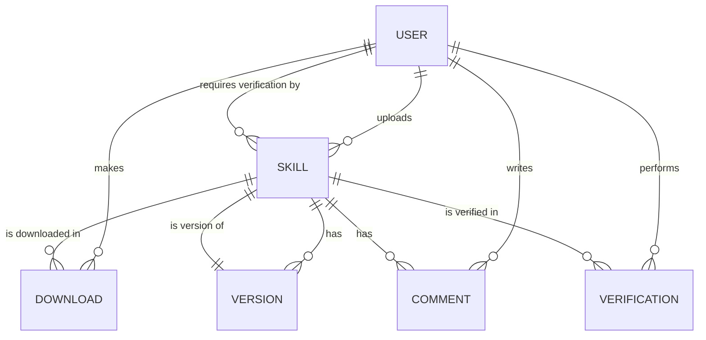

# Entity Model

## Entity Relationship Diagram

## USER

Represents a system user with a specific role (member, verifier, or administrator).

| Attribute   | Description              | Data Type | Length/Precision | Validation Rules          |
|-------------|--------------------------|-----------|------------------|---------------------------|
| id          | Unique identifier        | Long      | 19               | Primary Key, Sequence     |
| email       | Email address            | String    | 255              | Not Null, Unique          |
| password    | Encrypted password       | String    | 255              | Not Null                  |
| first_name  | User's first name        | String    | 100              | Not Null                  |
| last_name   | User's last name         | String    | 100              | Not Null                  |
| role        | User role                | String    | 20               | Not Null, Values: MEMBER, VERIFIER, ADMIN |
| created_at  | Account creation timestamp | DateTime | -                | Not Null, Default: Now    |
| updated_at  | Last update timestamp    | DateTime  | -                | Not Null, Default: Now    |

## SKILL

Represents a skill in the catalog with metadata about its purpose and verification status.

| Attribute      | Description                           | Data Type | Length/Precision | Validation Rules          |
|----------------|---------------------------------------|-----------|------------------|---------------------------|
| id             | Unique identifier                     | Long      | 19               | Primary Key, Sequence     |
| title          | Skill title                           | String    | 255              | Not Null                  |
| description    | Detailed description                  | String    | 2000             | Not Null                  |
| author_id      | Creator user ID                       | Long      | 19               | Foreign Key, Not Null     |
| file_path      | Path to skill markdown file           | String    | 500              | Not Null, Unique          |
| verification_status | Verification status              | String    | 20               | Not Null, Values: PENDING, VERIFIED, REJECTED |
| created_at     | Skill creation timestamp              | DateTime  | -                | Not Null, Default: Now    |
| updated_at     | Last update timestamp                 | DateTime  | -                | Not Null, Default: Now    |

## VERSION

Represents a version of a skill, tracking all updates made to the skill over time.

| Attribute    | Description                    | Data Type | Length/Precision | Validation Rules          |
|--------------|--------------------------------|-----------|------------------|---------------------------|
| id           | Unique identifier              | Long      | 19               | Primary Key, Sequence     |
| skill_id     | Parent skill ID                | Long      | 19               | Foreign Key, Not Null     |
| version      | Version number                 | String    | 50               | Not Null                  |
| file_path    | Path to skill markdown file    | String    | 500              | Not Null                  |
| notes        | Change notes                   | String    | 1000             | Optional                  |
| created_at   | Version creation timestamp     | DateTime  | -                | Not Null, Default: Now    |

## DOWNLOAD

Represents a download of a skill, supporting both authenticated and anonymous users.

| Attribute     | Description                          | Data Type | Length/Precision | Validation Rules          |
|---------------|--------------------------------------|---------|--|------------------|---------------------------|
| id            | Unique identifier                    | Long      | 19               | Primary Key, Sequence     |
| user_id       | Downloading user ID (nullable for anonymous) | Long   | 19               | Foreign Key, Optional     |
| skill_id      | Downloaded skill ID                  | Long      | 19               | Foreign Key, Not Null     |
| downloaded_at | Download timestamp                   | DateTime  | -                | Not Null, Default: Now    |
| ip_address    | IP address for anonymous downloads   | String    | 45               | Optional                  |
| session_id    | Session identifier for anonymous downloads | String | 255             | Optional                  |

## COMMENT

Represents a community comment on a skill.

| Attribute    | Description                    | Data Type | Length/Precision | Validation Rules          |
|--------------|--------------------------------|-----------|------------------|---------------------------|
| id           | Unique identifier              | Long      | 19               | Primary Key, Sequence     |
| user_id      | Commenting user ID             | Long      | 19               | Foreign Key, Not Null     |
| skill_id     | Commented skill ID             | Long      | 19               | Foreign Key, Not Null     |
| content      | Comment text                   | String    | 1000             | Not Null                  |
| created_at   | Comment creation timestamp     | DateTime  | -                | Not Null, Default: Now    |

## VERIFICATION

Represents a verification attempt by a verifier on a skill.

| Attribute     | Description                          | Data Type | Length/Precision | Validation Rules          |
|---------------|--------------------------------------|-----------|------------------|---------------------------|
| id            | Unique identifier                    | Long      | 19               | Primary Key, Sequence     |
| skill_id      | Skill being verified                 | Long      | 19               | Foreign Key, Not Null     |
| verifier_id   | Verifying user ID                    | Long      | 19               | Foreign Key, Not Null     |
| status        | Verification outcome                 | String    | 20               | Not Null, Values: PENDING, VERIFIED, REJECTED |
| notes         | Verifier's notes                     | String    | 1000             | Optional                  |
| verified_at   | Verification completion timestamp    | DateTime  | -                | Optional                  |
| created_at    | Verification request timestamp       | DateTime  | -                | Not Null, Default: Now    |

**Constraints:**
- For anonymous downloads (user_id is NULL), at least ip_address or session_id must be provided
- A skill can have only one active verification process at a time (PENDING status)
- Download history is immutable once recorded
- Comments cannot be edited after creation
- A new version must have a higher version number than the previous version
- When a new version is uploaded, the skill's verification status resets to PENDING
